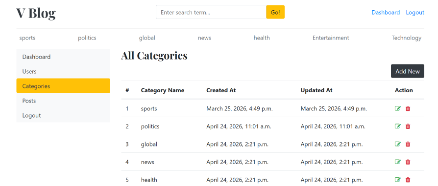
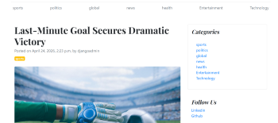
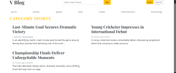

# 📝 Django Blog Application

A full-featured blog web application built using Django. This project allows users to create, read, update, and delete blog posts with category-based filtering and an admin dashboard.Can also write the comments can search for blogs.Created login based authentication.

---

## 🚀 Live Demo

👉 https://vishnu175.pythonanywhere.com/

---

## Overview
In this Blogging page user can : 
- Perform crud operations on posts, categories.
- User should need to login or register to view dashboard page and to perform crud operatuons
- Only Authorized users (admin,manager) can view users section on dashbord editors or unauthorized users cannot view or edit the users page
- Users can also write comments only after login 
- Can view detail blog page, can search by keywords,

---

## 📌 Features

- 📰 Create, edit, delete blog posts and Categories, Users-only by admin and managers
- 🗂️ Category-based filtering (Tech, Sports, Politics, etc.)
- 🔍 Search functionality
- 🧑‍💼 Admin dashboard
- 📱 Responsive UI
- 🔐 User authentication

---

## 🛠️ Tech Stack

- **Backend:** Django, Python
- **Frontend:** HTML, CSS, Bootstrap
- **Database:** SQLite 
- **Deployment:** PythonAnywhere
- **Version Control:** Git & GitHub

---

## Demo Vide0
Watch the demo here
https://1drv.ms/v/c/2d721db33fcdc856/IQD9dpP4JWcmQLMzxuv2lAe-AbwynBK-UyPfwyfuB-Vgxak?e=K1AU8v

---

## Screenshots

### Home

### Dashboard

### Blog Detail View

### Category Based View Page

