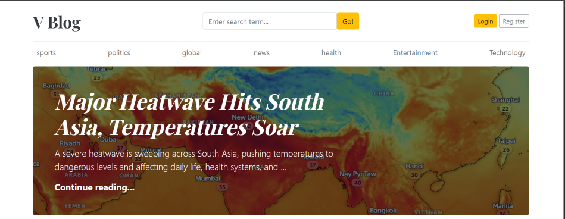
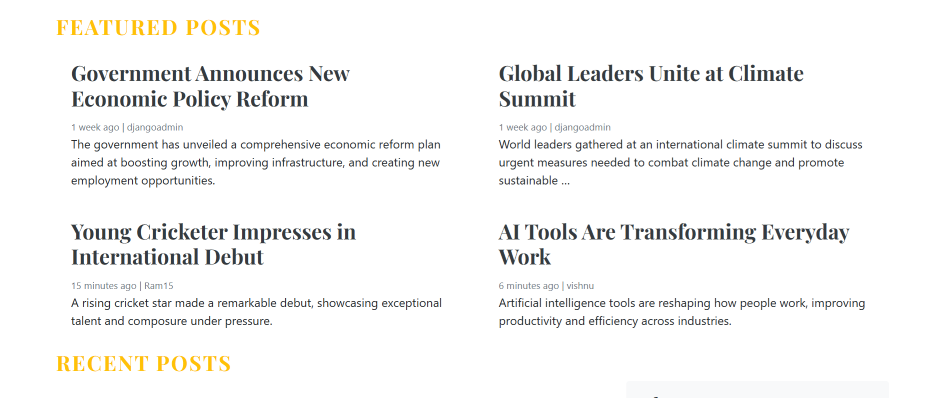

# 📝 Django Blog Application

A full-featured blog web application built using Django. This project allows users to create, read, update, and delete blog posts with category-based filtering and an admin dashboard.Can also write the comments can search for blogs.Created login based authentication.

---

## 🚀 Live Demo

👉 https://vishnu175.pythonanywhere.com/

---

## 📌 Features

- 📰 Create, edit, delete blog posts and Categories, Users-only by admin and managers
- 🗂️ Category-based filtering (Tech, Sports, Politics, etc.)
- 🔍 Search functionality
- 🧑‍💼 Admin dashboard
- 📱 Responsive UI
- 🔐 User authentication

---

## 🛠️ Tech Stack

- **Backend:** Django, Python
- **Frontend:** HTML, CSS, Bootstrap
- **Database:** SQLite 
- **Deployment:** PythonAnywhere
- **Version Control:** Git & GitHub

---

## Screenshots

### Home

